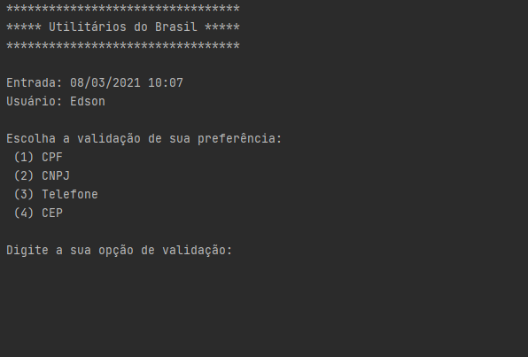
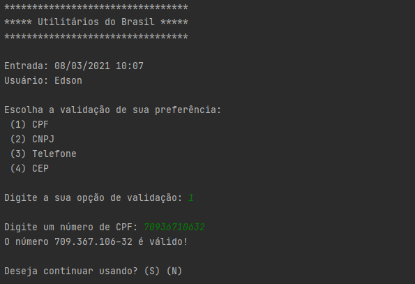
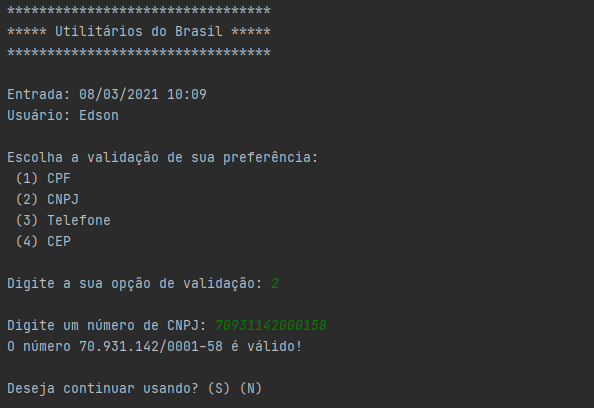
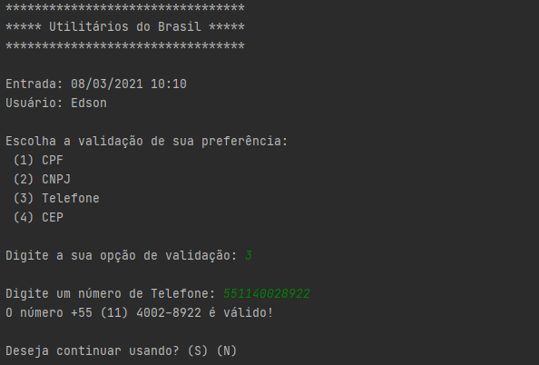
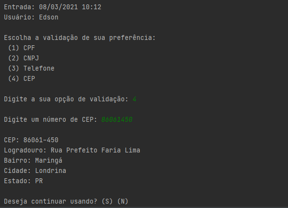

<h1 align="center">Utilitários do Brasil</h1>

Programa de utilitários para validações de padrões brasileiros, como: CPF, CNPJ, Telefone e CEP.  Projeto de estudo para desenvolvimento em Python.

<h1 align="center">
  
</h1>

O projeto <b>Utilitários do Brasil</b> foi desenvolvido em Python 3, com a orientação do curso <b><i>Python Brasil: Validação de dados no padrão nacional</i></b> da plataforma ALURA.
Esse projeto aborda fatiamento de strings, expressões regulares, importação de bibliotecas, APIs e execução de requestes HTTP.

 

 <table style="width:100%" border="0px">
  <tr>
    <td></td>
    <td></td>
  </tr>
  <tr>
    <td></td>
    <td></td>
  </tr>
</table> 

